# llm-d inference stack — current runtime (v1)

One diagram, scoped to **what exists today** (Phase 0 synced + T5 authored, not yet
synced). Source of truth: [LLM_PLAN.md](../../LLM_PLAN.md) + the T5 files
([llm-d-recipe.yaml](../../argocd/applications/mlops/llm-d-recipe.yaml),
[argocd/helm-values/llm-d-router/](../../argocd/helm-values/llm-d-router/),
[argocd/charts/llm-d-modelserver/](../../argocd/charts/llm-d-modelserver/)).
Runtime shapes verified by `helm template` of the pinned charts.

---

## Diagram (v1) — Current runtime (request → smart pod pick)

What a single in-cluster request does once T5 is synced — **only what exists today**, traffic
ports only (metrics omitted), no future pieces. The `llm-d-router-standalone` release renders
one Deployment with **two containers** (an Envoy data-path proxy + the EPP endpoint-picker)
plus an `InferencePool`; our `llm-d-modelserver` chart renders the vLLM decode pod. The EPP
scores decode pods by KV-cache/queue and Envoy routes there.

**Read this as:** the smart routing (the whole point of llm-d) is the
`Envoy → ext-proc → EPP → InferencePool` loop. With **one** decode replica (sandbox / D4)
cross-pod prefix routing is moot — the in-EPP approximate scorer suffices. Today the
**entry point is the router Service `:80`** (port-forward target for T7); the Istio Gateway
that will front it is T6 (not built yet).

> **Uncertainty flagged:** the EPP Service does **not** set `appProtocol: http2` on `:9002`
> though the Istio inference task expects HTTP/2 to the EPP. Untested on-cluster — if
> ext-proc scoring doesn't engage after sync, patch `appProtocol: http2` on. (LLM_PLAN §3.)

---

## Key references

- ApplicationSet (the one place to add a model): [llm-d-recipe.yaml](../../argocd/applications/mlops/llm-d-recipe.yaml)
- Shared router values: [argocd/helm-values/llm-d-router/values.yaml](../../argocd/helm-values/llm-d-router/values.yaml) (single merged file — upstream base + optimized-baseline @v0.8.1, our deltas marked `# OVERRIDE`)
- Our modelserver chart: [argocd/charts/llm-d-modelserver/](../../argocd/charts/llm-d-modelserver/)
- Plan + contracts: [LLM_PLAN.md](../../LLM_PLAN.md) §3 (verified shapes), §4 (packaging + contracts), §0 (checkpoints)

## What is confirmed vs inferred

- **Confirmed (helm template, this session):** router release renders Envoy+EPP+InferencePool; InferencePool name = release name; EPP image pinned v0.9.0; targetPorts 8000 / endpointPickerRef 9002; matchLabels `{guide, model}`; decode pod carries matching labels and has **no** HF_TOKEN.
- **Inferred (not run on-cluster):** the live request path (Envoy ext-proc → EPP → decode) — standard llm-d behaviour but unverified here.
- **Object set:** the diagram shows only the runtime-relevant objects. The router release also emits 2 ConfigMaps (envoy + plugins) + a ServiceAccount + RBAC (2 Role / 2 RoleBinding); the modelserver release adds its SA. Omitted for focus.
- **Unclear / to verify at sync:** EPP `:9002` `appProtocol` for Istio ext-proc; GPU capacity on `ubuntu-gpu`.
