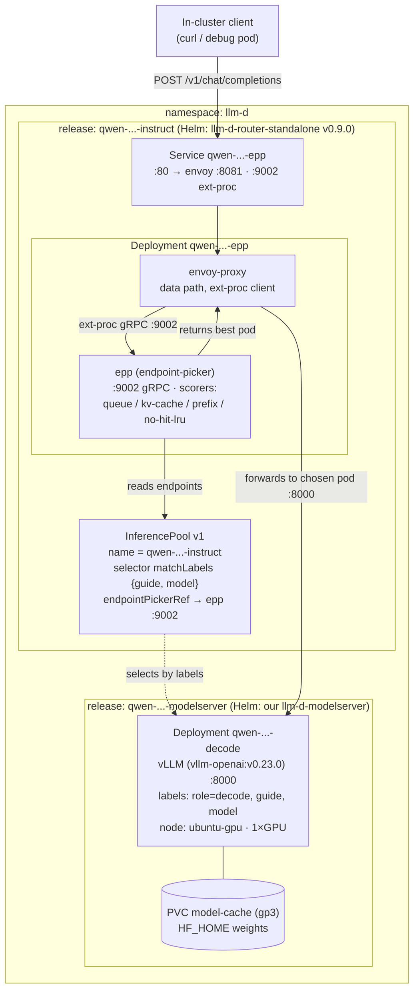
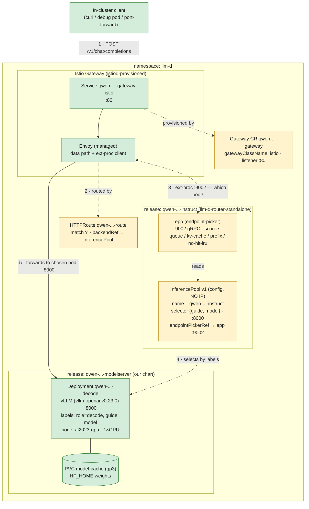

# llm-d inference stack — request runtime: v1 (M1) vs v2 (T6)

Two diagrams of the in-cluster request path: **v1** = what exists today (M1 — the router
chart's own bundled Envoy), **v2** = the T6 change (an Istio Gateway becomes the edge).
Source of truth: [LLM_PLAN.md](../../LLM_PLAN.md) + the recipe/chart files
([llm-d-recipe.yaml](../../argocd/applications/mlops/llm-d-recipe.yaml),
[argocd/helm-values/llm-d-router/](../../argocd/helm-values/llm-d-router/),
[argocd/charts/llm-d-modelserver/](../../argocd/charts/llm-d-modelserver/)).
Runtime shapes verified by `helm template` of the pinned charts.

---

## Diagram (v1) — Current runtime (request → smart pod pick)

What a single in-cluster request does once T5 is synced — **only what exists today**, traffic
ports only (metrics omitted), no future pieces. The `llm-d-router-standalone` release renders
one Deployment with **two containers** (an Envoy data-path proxy + the EPP endpoint-picker)
plus an `InferencePool`; our `llm-d-modelserver` chart renders the vLLM decode pod. The EPP
scores decode pods by KV-cache/queue and Envoy routes there.

**Read this as:** the smart routing (the whole point of llm-d) is the
`Envoy → ext-proc → EPP → InferencePool` loop. With **one** decode replica (sandbox / D4)
cross-pod prefix routing is moot — the in-EPP approximate scorer suffices. Today the
**entry point is the router Service `:80`** (port-forward target for T7); the Istio Gateway
that will front it is T6 (not built yet).

> **Uncertainty flagged:** the EPP Service does **not** set `appProtocol: http2` on `:9002`
> though the Istio inference task expects HTTP/2 to the EPP. Untested on-cluster — if
> ext-proc scoring doesn't engage after sync, patch `appProtocol: http2` on. (LLM_PLAN §3.)

---

## Diagram (v2) — T6: data path vs control plane through the Istio Gateway

The T6 change adds a `Gateway` (`gatewayClassName: istio`) + an `HTTPRoute` to our
`llm-d-modelserver` chart. The diagram **separates the two planes**:

- **Data path (green, solid)** — the actual request bytes, a straight vertical spine:
  `client → Istio Gateway Envoy (Service …-gateway-istio:80) → the chosen decode pod :8000`.
  This is the *only* path real traffic takes (the response streams back up the same green line).
- **Control plane (yellow, dotted)** — config + per-request decision, no inference bytes:
  the `Gateway` CR (beside the gateway it provisions); the `HTTPRoute` that programs the
  route + ext-proc; the `InferencePool` (a config CRD with **no IP** — you can't curl it)
  naming the pod set (selector) + the picker (`endpointPickerRef → EPP`); the **EPP** that
  answers "which pod?" per request over ext-proc. Pool/EPP **decide** the pod; the Envoy
  then sends bytes straight to it.

**Read this as:** the **green solid** spine is the only place bytes go —
`client → Gateway Envoy → decode pod`, top to bottom (response streams back up the same
line). Everything **yellow dotted** is logic, not traffic: `Gateway CR` sits beside the
gateway it provisions; `HTTPRoute` only *configures* the Envoy's route + ext-proc; `EPP` +
`InferencePool` only *decide* which pod (the ext-proc consult is a per-request gRPC
question, not inference data). The `InferencePool` is virtual — traffic never enters it; it
resolves to pod IPs and the EPP picks one. v2 swaps the chart's bundled dev-Envoy for a
managed Istio edge — the attach point for external doors (ALB/Traefik; AWS LBC can't front
Gateway-API directly → it fronts the Gateway Service) and for L7/mesh features (canary
weight-split, mTLS, AuthorizationPolicy, unified access-log/metrics/tracing). With one
replica the pick is always the same pod; the payoff lands at multiple replicas.

> **Uncertainty flagged:** v2 is **authored, not synced** — the `Gateway`/`HTTPRoute`
> templates exist in the chart but are **not yet pushed to `master`**, so the
> `qwen-...-gateway-istio` Service does not exist in-cluster yet. That the Gateway Envoy
> fully bypasses the bundled router Envoy is **inferred from the GAIE/Istio design**, not
> observed — confirm after sync via EPP logs + a `qwen-...-gateway-istio` port-forward.

---

## Key references

- ApplicationSet (the one place to add a model): [llm-d-recipe.yaml](../../argocd/applications/mlops/llm-d-recipe.yaml)
- Shared router values: [argocd/helm-values/llm-d-router/values.yaml](../../argocd/helm-values/llm-d-router/values.yaml) (single merged file — upstream base + optimized-baseline @v0.8.1, our deltas marked `# OVERRIDE`)
- Our modelserver chart: [argocd/charts/llm-d-modelserver/](../../argocd/charts/llm-d-modelserver/)
- Plan + contracts: [LLM_PLAN.md](../../LLM_PLAN.md) §3 (verified shapes), §4 (packaging + contracts), §0 (checkpoints)

## What is confirmed vs inferred

- **Confirmed (helm template, this session):** router release renders Envoy+EPP+InferencePool; InferencePool name = release name; EPP image pinned v0.9.0; targetPorts 8000 / endpointPickerRef 9002; matchLabels `{guide, model}`; decode pod carries matching labels and has **no** HF_TOKEN. **v2:** the `Gateway` (`gatewayClassName: istio`) + `HTTPRoute` (backendRef InferencePool name = `resourceName`) render from the modelserver chart; GatewayClass `istio` is Accepted live; InferencePool name verified live = `qwen-qwen2-5-0-5b-instruct`.
- **Inferred (not run on-cluster):** the live request path (Envoy ext-proc → EPP → decode) — standard llm-d behaviour but unverified here. **v2:** the istiod-provisioned `qwen-...-gateway-istio` Service + the Gateway-Envoy ext-proc path are design-inferred — v2 is **not yet synced** (not pushed to `master`).
- **Object set:** the diagram shows only the runtime-relevant objects. The router release also emits 2 ConfigMaps (envoy + plugins) + a ServiceAccount + RBAC (2 Role / 2 RoleBinding); the modelserver release adds its SA. Omitted for focus.
- **Unclear / to verify at sync:** EPP `:9002` `appProtocol` for Istio ext-proc; GPU capacity on `al2023-gpu`; whether the istiod-provisioned gateway Service exposes `15021` (needed later for the ALB healthcheck, T13).
